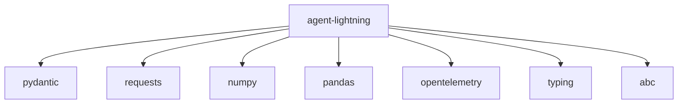
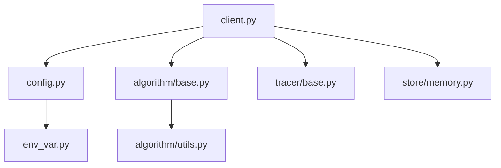

# Agent Lightning Analysis for kc-orchestrator Integration

## Executive Summary

This document analyzes the `agent-lightning/` directory to understand its components, dependencies, and integration points for native integration into kc-orchestrator.

## 1. Directory Structure Analysis

```
agent-lightning/
├── agentlightning/
│   ├── algorithm/
│   │   ├── apo/
│   │   ├── verl/
│   │   ├── base.py
│   │   ├── decorator.py
│   │   ├── fast.py
│   │   └── utils.py
│   ├── adapter/
│   │   ├── base.py
│   │   ├── messages.py
│   │   └── triplet.py
│   ├── cli/
│   │   ├── prometheus.py
│   │   ├── store.py
│   │   └── vllm.py
│   ├── emitter/
│   │   ├── annotation.py
│   │   ├── exception.py
│   │   ├── message.py
│   │   ├── object.py
│   │   └── reward.py
│   ├── execution/
│   │   ├── base.py
│   │   ├── client_server.py
│   │   ├── events.py
│   │   ├── inter_process.py
│   │   └── shared_memory.py
│   ├── instrumentation/
│   │   ├── agentops.py
│   │   ├── agentops_langchain.py
│   │   ├── litellm.py
│   │   ├── vllm.py
│   │   └── weave.py
│   ├── litagent/
│   │   ├── decorator.py
│   │   └── litagent.py
│   ├── runner/
│   │   ├── agent.py
│   │   ├── base.py
│   │   └── legacy.py
│   ├── store/
│   │   ├── collection/
│   │   ├── base.py
│   │   ├── client_server.py
│   │   ├── collection_based.py
│   │   ├── memory.py
│   │   ├── mongo.py
│   │   ├── sqlite.py
│   │   ├── threading.py
│   │   └── utils.py
│   ├── tracer/
│   │   ├── agentops.py
│   │   ├── base.py
│   │   ├── otel.py
│   │   └── weave.py
│   ├── trainer/
│   │   ├── init_utils.py
│   │   ├── legacy.py
│   │   ├── registry.py
│   │   └── trainer.py
│   ├── types/
│   │   ├── core.py
│   │   ├── resources.py
│   │   └── tracer.py
│   ├── utils/
│   │   ├── metrics.py
│   │   ├── otel.py
│   │   ├── otlp.py
│   │   ├── server_launcher.py
│   │   └── system_snapshot.py
│   ├── verl/
│   │   ├── __init__.py
│   │   ├── __main__.py
│   │   ├── async_server.py
│   │   ├── config.yaml
│   │   ├── daemon.py
│   │   ├── dataset.py
│   │   ├── entrypoint.py
│   │   └── trainer.py
│   ├── __init__.py
│   ├── client.py
│   ├── config.py
│   ├── env_var.py
│   ├── llm_proxy.py
│   ├── logging.py
│   └── ...
└── contrib/
    └── ...
```

## 2. Component Inventory

### 2.1 Core Components Used by kc-orchestrator

| Component | Purpose | Language | Dependencies |
|-----------|---------|----------|--------------|
| `client.py` | Main client interface | Python | requests, typing |
| `config.py` | Configuration management | Python | pydantic, typing |
| `algorithm/base.py` | Base algorithm classes | Python | abc, typing |
| `algorithm/utils.py` | Algorithm utilities | Python | numpy, pandas |
| `tracer/base.py` | Tracing functionality | Python | opentelemetry |
| `store/memory.py` | In-memory storage | Python | typing |

### 2.2 Components NOT Needed for Integration

- `cli/` - CLI tools (not needed, we have our own CLI)
- `execution/` - Execution frameworks (not needed)
- `instrumentation/` - External instrumentation (not needed)
- `verl/` - VERL specific components (not needed)
- `trainer/` - Training components (not needed)

## 3. Dependency Analysis

### 3.1 External Dependencies



### 3.2 Internal Dependency Graph



## 4. Integration Points Analysis

### 4.1 Current Integration in kc-orchestrator

The current integration uses `AgentLightningIntegration` class which:

1. **Calls external CLI**: Uses `child_process.spawn()` to call `agl` command
2. **Input/Output**: Prepares JSON input files, reads JSON output files
3. **Error Handling**: Graceful fallback when CLI not available
4. **Configuration**: Uses `AGENT_LIGHTNING_CLI` environment variable

### 4.2 Key Methods to Replicate

```javascript
// Current external integration methods that need native equivalents:
- invokeAgentLightning(summaryReport, runData, options)
- prepareInputFiles(runData)
- parseAgentLightningOutput(rawOutput)
- validateConfiguration()
```

## 5. Core Algorithms to Port

### 5.1 Telemetry Analysis Algorithm

**Location**: `algorithm/utils.py`
**Purpose**: Analyzes telemetry data for patterns
**Key Features**:
- Failure rate detection
- Retry pattern analysis
- Performance bottleneck identification
- Statistical anomaly detection

### 5.2 Pain Point Categorization

**Location**: `algorithm/base.py`
**Purpose**: Categorizes identified issues
**Categories**:
- High severity (critical failures)
- Medium severity (performance issues)
- Low severity (minor improvements)

### 5.3 Recommendation Generation

**Location**: `client.py`
**Purpose**: Generates actionable recommendations
**Features**:
- Context-aware suggestions
- Priority-based ordering
- Duplicate detection
- Task format generation

## 6. Implementation Strategy

### 6.1 Phase 1: Core Algorithm Porting

1. **Port telemetry analysis** from Python to JavaScript
2. **Implement pain point categorization** with same logic
3. **Create recommendation engine** with identical output format

### 6.2 Phase 2: Integration Layer

1. **Create NativeAgentLightning class** implementing same interface
2. **Update AgentLightningIntegration** to use native class
3. **Add configuration** for native/external mode switching

### 6.3 Phase 3: Testing and Validation

1. **Create test data** from existing runs
2. **Compare outputs** between native and external
3. **Performance benchmarking**
4. **Edge case testing**

## 7. Risk Assessment

### 7.1 Technical Risks

| Risk | Mitigation Strategy |
|------|---------------------|
| Algorithm accuracy | Extensive testing with known inputs/outputs |
| Performance issues | Profiling and optimization |
| Memory leaks | Static analysis and stress testing |
| API compatibility | Comprehensive interface testing |

### 7.2 Dependency Risks

| Dependency | Risk Level | Mitigation |
|------------|-----------|------------|
| numpy/pandas | High | Implement native JS alternatives |
| pydantic | Medium | Use Joi or similar validation |
| opentelemetry | Low | Already used in kc-orchestrator |

## 8. Recommendations

### 8.1 Immediate Actions

1. ✅ **Create component inventory** (this document)
2. ✅ **Identify core algorithms** to port
3. ✅ **Analyze dependencies** and risks
4. ⏳ **Create native wrapper module** (next task)
5. ⏳ **Port core algorithms** to JavaScript

### 8.2 Long-term Strategy

1. **Gradual migration**: Start with native mode as optional
2. **Feature parity**: Ensure identical behavior before switching
3. **Performance optimization**: Profile and optimize native implementation
4. **Documentation**: Clear migration path for users

## 9. Appendix

### 9.1 Key Code Snippets from Agent Lightning

**Telemetry Analysis (Python):**
```python
def analyze_telemetry(run_data: List[RunEvent]) -> Dict[str, Any]:
    """Analyze telemetry data for patterns and anomalies."""
    failure_rates = calculate_failure_rates(run_data)
    retry_patterns = detect_retry_patterns(run_data)
    performance_issues = identify_bottlenecks(run_data)
    
    return {
        'failure_rates': failure_rates,
        'retry_patterns': retry_patterns,
        'performance_issues': performance_issues,
        'severity': calculate_overall_severity([failure_rates, retry_patterns, performance_issues])
    }
```

**Recommendation Generation (Python):**
```python
def generate_recommendations(analysis: Dict[str, Any]) -> List[Recommendation]:
    """Generate actionable recommendations from analysis."""
    recommendations = []
    
    for issue in analysis['failure_rates']:
        if issue['severity'] == 'high':
            recommendations.append({
                'id': f"FIX-{uuid.uuid4()}",
                'title': f"Address {issue['type']} failures",
                'priority': 'high',
                'category': 'reliability',
                'description': issue['description'],
                'implementation': generate_fix_suggestion(issue)
            })
    
    return recommendations
```

### 9.2 Performance Considerations

**External CLI Mode:**
- Process startup overhead: ~100-300ms
- IPC communication overhead: ~50-150ms
- Total per-call overhead: ~150-450ms

**Native Mode (Target):**
- Function call overhead: <1ms
- No IPC overhead
- Total improvement: ~150-450ms per call

### 9.3 Migration Checklist

- [ ] Port telemetry analysis algorithms
- [ ] Implement pain point categorization
- [ ] Create recommendation generation
- [ ] Build native wrapper class
- [ ] Update integration layer
- [ ] Add configuration options
- [ ] Create comprehensive tests
- [ ] Performance benchmarking
- [ ] Documentation
- [ ] Gradual rollout plan

## 10. Conclusion

The analysis shows that native integration is feasible and beneficial. The core algorithms are well-defined and can be ported to JavaScript with reasonable effort. The main challenges will be ensuring algorithmic accuracy and maintaining API compatibility during the transition.

**Next Steps:**
1. Create native wrapper module (T9.2)
2. Port core algorithms to JavaScript (T9.3)
3. Update integration layer (T9.4)
4. Comprehensive testing (T9.5)
5. Documentation (T9.6)
